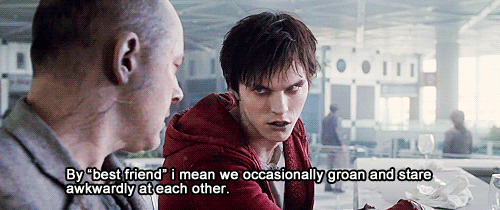

```{r setup, include=FALSE}
knitr::opts_chunk$set(echo = TRUE)
```


```{r image, echo=FALSE, fig.align='center', out.width='88%', fig.cap='Warm Bodies (2013) a.k.a. quality cinema'}
 #input a graphic stored in the project just by using the file name
```

## Background

This data includes the first name, last name, and gender of the entire population of 1000 people who have survived the zombie apocalypse and are now ekeing out an existence somewhere on the East Coast, along with several other variables (height, weight, age, number of years of education, number of zombies they have killed, and college major
```{r read data}
zombiedata <- (read.csv("https://raw.githubusercontent.com/fuzzyatelin/fuzzyatelin.github.io/master/AN588_Fall23/zombies.csv"))

head(zombiedata)
```

Also, load necessary packages
```{r prelims, warning = FALSE, message=FALSE}
library(ggplot2) #needed to visualize data in ggplot
library(ggpubr) #package includes ggarrange function to nicely organize ggplots in a panel
library(dplyr) #needed for sampling functions
library(tidyverse) #load tidyverse to use reduce() function in question
```
## Question 1: Population means and standard deviations
### Calculate the population mean and standard deviation for each quantitative random variable (height, weight, age, number of zombies killed, and years of education). 
NOTE: You will not want to use the built in var() and sd() commands as these are for samples.

First write a quick function to calculate standard deviation since we cannot use sd() for a population.
```{r stdev function}
pop_v <- function(x) {sum((x - mean(x))^2)/(length(x))} #a function to calculate population variance of x
pop_sd <- function(x) {sqrt(pop_v(x))} #a function to calculate population standard deviation of x (x is a data set) using the population variance
```

Now use the mean() function and newly created pop_sd() function to calculate the mean and standard deviation of each variable.
#### Height
```{r population height}
pop.height.mean<-mean(zombiedata$height) #calculate and store the mean of the survivors' heights
pop.height.mean
pop.height.sd<-pop_sd(zombiedata$height) #calculate and store the population standard deviation of the survivors' heights
pop.height.sd
```
#### Weight
```{r population weight}
pop.weight.mean<-mean(zombiedata$weight)
pop.weight.mean
pop.weight.sd<-pop_sd(zombiedata$weight)
pop.weight.sd
```
#### Age
```{r population age}
pop.age.mean<-mean(zombiedata$age)
pop.age.mean
pop.age.sd<-pop_sd(zombiedata$age)
pop.age.sd
```
#### Zombies Killed
```{r population zk}
pop.zk.mean<-mean(zombiedata$zombies_killed)
pop.zk.mean
pop.zk.sd<-pop_sd(zombiedata$zombies_killed)
pop.zk.sd
```
#### Years of Education
```{r population yoe}
pop.yoe.mean<-mean(zombiedata$years_of_education)
pop.yoe.mean
pop.yoe.sd<-pop_sd(zombiedata$years_of_education)
pop.yoe.sd
```

## Question 2: Boxplots by gender 
### Use {ggplot} to make boxplots of each of these variables by gender.

Plot box plots.
```{r box plots}
heightbox <- ggplot(zombiedata, #create a plot using zombiedata
        aes(x=gender, y=height, fill=gender)) + #use gender as the x-axis and height as the y-axis. Fill the colors by gender
    geom_boxplot() + #make it a boxplot
    theme_classic() + #use theme_classic because it looks nicer than the default
    labs(title = "Height of Survivors", x = "Gender", y = "Height (in)") + #label the title and axes #Now rinse and repeat for the other plots
    scale_fill_manual(values=c("#c7254e", "#007D00", "#007AEA")) #also let's change the colors to match the markdown theme, just for fun
weightbox <- ggplot(zombiedata, aes(x=gender, y=weight, fill=gender)) + geom_boxplot() + theme_classic() +   labs(title = "Weight of Survivors",x = "Gender", y = "Weight (lbs)") + scale_fill_manual(values=c("#c7254e", "#007D00", "#007AEA")) 
agebox <- ggplot(zombiedata, aes(x=gender, y=age, fill=gender)) + geom_boxplot() + theme_classic() + labs(title = "Age of Survivors",x = "Gender", y = "Age (years)") + scale_fill_manual(values=c("#c7254e", "#007D00", "#007AEA"))
zkbox <- ggplot(zombiedata, aes(x=gender, y=zombies_killed, fill=gender)) + geom_boxplot() + theme_classic() +   labs(title = "Surivors' Zombies Killed",x = "Gender", y = "Number of Zombies Killed") + scale_fill_manual(values=c("#c7254e", "#007D00", "#007AEA")) 
yoebox <- ggplot(zombiedata, aes(x=gender, y=years_of_education, fill=gender)) + geom_boxplot() + theme_classic() +   labs(title = "Survivors' Years of Ed",x = "Gender", y = "Years of Education") + scale_fill_manual(values=c("#c7254e", "#007D00", "#007AEA")) 

ggarrange(heightbox, weightbox, agebox, zkbox, yoebox,ncol = 3, nrow = 2, #Arrange all five plots into a 3x2 panel
          legend="none") #Don't show the legend for each plot because that's too busy and not necessary
```

## Question 3: Scatterplots of height and weight
### Use {ggplot} to make scatterplots of height and weight in relation to age. Do these variables seem to be related? In what way?

Plot scatter plots.
```{r scatterplots}
heightagescatter <- ggplot(zombiedata, #create a plot using zombiedata
          aes(x=age, y=height)) + #use age as the x-axis and height as the y-axis
      geom_point(size=2, shape=1, color="#c7254e") + #make it a scatterplot and define the appearance of the points
      theme_classic() + #use theme_classic() because it looks nicer than the default
      labs(title = "Height by Age",x = "Age (years)", y = "Height (in)") #label the title and axes
#Repeat for weight
weightagescatter <- ggplot(zombiedata, aes(x=age, y=weight)) + geom_point(size=2, shape=1, color="#c7254e") + theme_classic() +   labs(title = "Weight by Age",x = "Age (years)", y = "Weight (lbs)")

ggarrange(heightagescatter, weightagescatter, #Arrange all five plots into a 3x2 panel
          ncol = 2, nrow = 1, legend="none") #Don't show the legend for each plot because that's too busy and not necessary
```

Age and height certainly seem to be related in that older survivors are taller. Age and weight also appear to be related in that older survivors seem to weigh more.

## Question 4: Are the distributions normal?
### Using histograms and Q-Q plots, check whether the quantitative variables seem to be drawn from a normal distribution. Which seem to be and which do not (hint: not all are drawn from the normal distribution)? For those that are not normal, can you determine from which common distribution they are drawn?

#### Height
```{r hist and Q-Q height}
par(mfrow=c(1,2))
hist(zombiedata$height, main = "Histogram of Survivor Height", col = "#c7254e") #histogram
qqnorm(zombiedata$height, main = "Normal QQ plot of Survivor Height") #q-q graph
qqline(zombiedata$height, col = "#c7254e")
```

Height appears to be normally distributed.

#### Weight
```{r hist and Q-Q weight}
par(mfrow=c(1,2))
hist(zombiedata$weight, main = "Histogram of Survivor Weight", col = "#c7254e")
qqnorm(zombiedata$weight, main = "Normal QQ plot of Survivor Weight")
qqline(zombiedata$weight, col = "#c7254e")
```

Weight appears to be normally distributed.

#### Age
```{r hist and Q-Q age}
par(mfrow=c(1,2))
hist(zombiedata$age, main = "Histogram of Survivor Age", col = "#c7254e")
qqnorm(zombiedata$age, main = "Normal QQ plot of Survivor Age")
qqline(zombiedata$age, col = "#c7254e")
```

Age appears to be drawn from a normal distribution.

#### Zombies Killed
```{r hist and Q-Q zombies killed}
par(mfrow=c(1,2))
hist(zombiedata$zombies_killed, main = "Histogram of Survivor Zombies Killed", col = "#c7254e")
qqnorm(zombiedata$zombies_killed, main = "Normal QQ plot of Zombies Killed")
qqline(zombiedata$zombies_killed, col = "#c7254e")
```

Number of zombies killed is definitely not normally distributed. This is especially clear in the Q-Q plot because the sample quantiles are not clearly linearly related to theoretical quantiles. It may be a poisson distribution since it is open ended counts of the independently occuring events of survivors having killed a certain number of zombies.

#### Years of Education
```{r hist and Q-Q years of education}
par(mfrow=c(1,2))
hist(zombiedata$years_of_education, main = "Histogram of Survivor Years of Education", col = "#c7254e")
qqnorm(zombiedata$years_of_education, main = "Normal QQ plot of Survivor Years of Education")
qqline(zombiedata$years_of_education, col = "#c7254e")
```
Years of education is definitely not normally distributed. This is especially clear in the Q-Q plot because the sample quantiles are not clearly linearly related to theoretical quantiles. It may be a poisson distribution since it is open ended counts of the independently occurring events of survivors having completed a certain number of years of education.

## Question 5: Sample mean and standard deviation

### Now use the sample() function to sample ONE subset of 30 zombie survivors (without replacement) from this population and calculate the mean and sample standard deviation for each variable. Also estimate the standard error for each variable, and construct the 95% confidence interval for each mean. Note that for the variables that are not drawn from the normal distribution, you may need to base your estimate of the CIs on slightly different code than for the normal…

```{r sample30, warning=FALSE}
set.seed(96) #set seed to any number so that every time you run this code, you get the same sample
sample30 <- sample_n(zombiedata, 30, replace=FALSE) #use sample_n() to sample whole rows from a dataframe. Using sample() can only sample from one vector like zombiedata$height. #replace=FALSE is the default, but why not specify it anyway, just to make sure.
head(sample30) #take a peek at the sample
```

Define a general function to calculate confidence intervals (for normally distributed data only).
```{r SE and CI function}
normalSE = function(x) { #create a function
    se = sd(x)/sqrt(length(x)) #that calculates standard error
    return(se)}

normalCI = function(x, CIlevel = 0.95) { #create a function
    upper = mean(x) + qnorm(1 - (1 - CIlevel)/2) * sqrt(var(x)/length(x)) #that calculates upper and lower confidence intervals based on a normal distribution
    lower = mean(x) + qnorm((1 - CIlevel)/2) * sqrt(var(x)/length(x))
    ci <- c(lower, upper)
    return(ci)}
```

#### Height
```{r sample30 height}
sample.height.mean <- mean(sample30$height) #mean of the sample
sample.height.stdev <- sd(sample30$height) #sd of the sample
sample.height.SE <- normalSE(sample30$height) #estimated standard error of the mean based on the sample
sample.height.CI <- normalCI(sample30$height, 0.95) #confidence interval of the sample mean

sample.height.mean
sample.height.stdev
sample.height.SE
sample.height.CI
```

#### Weight
```{r sample30 weight}
sample.weight.mean <- mean(sample30$weight)
sample.weight.stdev <- sd(sample30$weight)
sample.weight.SE <- normalSE(sample30$weight)
sample.weight.CI <- normalCI(sample30$weight, 0.95)

sample.weight.mean
sample.weight.stdev
sample.weight.SE
sample.weight.CI
```

#### Age
```{r sample30 age}
sample.age.mean <- mean(sample30$age)
sample.age.stdev <- sd(sample30$age)
sample.age.SE <- normalSE(sample30$age)
sample.age.CI <- normalCI(sample30$age, 0.95)

sample.age.mean
sample.age.stdev
sample.age.SE
sample.age.CI
```

Define a general function to calculate confidence intervals for a poisson distribution.

```{r SE and CI function poisson}
poissonSE = function(x) { #create a function
    se = sqrt(mean(x)/length(x)) #that calculates standard error
    return(se)}

poissonCI = function(x, CIlevel = 0.95) { #create a function
    upper = mean(x) + qpois(1 - (1 - CIlevel)/2, lambda=mean(x)) * sqrt(mean(x)/length(x)) #that calculates upper and lower confidence intervals based on a poisson distribution with lambda/mean of the data
    lower = mean(x) + qpois((1 - CIlevel)/2, lambda=mean(x)) * sqrt(mean(x)/length(x))
    ci <- c(lower, upper)
    return(ci)}
```

#### Zombies Killed
```{r sample30 zk}
sample.zk.mean <- mean(sample30$zombies_killed)
sample.zk.stdev <- sd(sample30$zombies_killed)
sample.zk.SE <- poissonSE(sample30$zombies_killed)
sample.zk.CI <- poissonCI(sample30$zombies_killed)

sample.zk.mean
sample.zk.stdev
sample.zk.SE
sample.zk.CI
```

#### Years of Education
```{r sample30 yoe}
sample.yoe.mean <- mean(sample30$years_of_education)
sample.yoe.stdev <- sd(sample30$years_of_education)
sample.yoe.SE <- poissonSE(sample30$years_of_education)
sample.yoe.CI <- poissonCI(sample30$years_of_education)

sample.yoe.mean
sample.yoe.stdev
sample.yoe.SE
sample.yoe.CI
```

## Question 6: 100 Samples and sampling distributions

### Now draw 99 more random samples of 30 zombie apocalypse survivors, and calculate the mean for each variable for each of these samples. Together with the first sample you drew, you now have a set of 100 means for each variable (each based on 30 observations), which constitutes a sampling distribution for each variable. What are the means and standard deviations of this distribution of means for each variable? How do the standard deviations of means compare to the standard errors estimated in [5]? What do these sampling distributions look like (a graph might help here)? Are they normally distributed? What about for those variables that you concluded were not originally drawn from a normal distribution?

First, draw the samples.
```{r sampling 99}
set.seed(4) #set seed so that everyone who runs this gets the same 99 samples
samples99 <- bind_rows(replicate(99, zombiedata %>% sample_n(30), simplify=F), .id="SampleID") #use replicate() to run sample_n() 99 times and use bind_rows() to put all those samples together into one dataframe
head(samples99)
```
Next, calculate the means of each variable for each sample.

#### Height
```{r sampling 99 height}
sample_means_height <- samples99 %>% # Specify data frame
    group_by(SampleID) %>% # Specify group indicator column
    summarise_at(vars(height), list(Mean_height = mean)) # Calculate the mean of the "height" column for each group
head(sample_means_height)
```
#### Weight
```{r sampling 99 weight}
sample_means_weight <- samples99 %>%
    group_by(SampleID) %>%
    summarise_at(vars(weight), list(Mean_weight = mean))
head(sample_means_weight)
```
#### Age
```{r sampling 99 age}
sample_means_age <- samples99 %>%
    group_by(SampleID) %>%
    summarise_at(vars(age), list(Mean_age = mean))
head(sample_means_age)
```
#### Zombies Killed
```{r sampling 99 zombies killed}
sample_means_zk <- samples99 %>%
    group_by(SampleID) %>% 
    summarise_at(vars(zombies_killed), list(Mean_zk = mean))
head(sample_means_zk)
```
#### Years of Education
```{r sampling 99 yoe}
sample_means_yoe <- samples99 %>%
    group_by(SampleID) %>%
    summarise_at(vars(years_of_education), list(Mean_yoe = mean))
head(sample_means_yoe)
```

Combine all 99 means into one dataframe just to have them all in one spot.
```{r combine samples}
all_sample_means_list <- list(sample_means_height, sample_means_weight, sample_means_age, sample_means_zk, sample_means_yoe) #combine all data frames in a list

all_sample_means <- all_sample_means_list %>% reduce(full_join, by='SampleID') #merge that list into one dataframe using reduce()
head(all_sample_means)
```

Also add that first sample taken in Question 5 as a 100th row.
```{r add row}
row100 = c(SampleID=100, Mean_height=sample.height.mean, Mean_weight=sample.weight.mean, Mean_age=sample.age.mean, Mean_zk=sample.zk.mean, Mean_yoe=sample.yoe.mean) #create a row of the means of each variable from the sample in question 5
hundred_sample_means = rbind(all_sample_means,row100) #bind the new row to the old dataframe of 99 samples to create a new one with 100 samples
str(hundred_sample_means) #check the structure to see that there are now 100 entries for each column
```

### What are the means and standard deviations of this distribution of means for each variable? How do the standard deviations of means compare to the standard errors estimated in [5]? 

#### Height
```{r height mean and stdev}
heights100_mean <- mean(hundred_sample_means$Mean_height) #mean of all the height sample means
heights100_stdev <- sd(hundred_sample_means$Mean_height) #stdev of all the height samples means

heights100_mean
heights100_stdev
```
The standard error of the mean calculated in question 5 was 0.8937125 which is fairly close to the standard deviation of the means 0.8036928.

#### Weight
```{r weight mean and stdev}
weights100_mean <- mean(hundred_sample_means$Mean_weight)
weights100_stdev <- sd(hundred_sample_means$Mean_weight)

weights100_mean
weights100_stdev
```
The standard error of the mean calculated in question 5 was 3.824212 which is fairly close to the standard deviation of the means 3.525196.

#### Age
```{r age mean and stdev}
ages100_mean <- mean(hundred_sample_means$Mean_age)
ages100_stdev <- sd(hundred_sample_means$Mean_age)

ages100_mean
ages100_stdev
```
The standard error of the mean calculated in question 5 was 0.5762748 which is fairly close to the standard deviation of the means 0.5254162.

#### Zombies Killed
```{r zk mean and stdev}
zk100_mean <- mean(hundred_sample_means$Mean_zk)
zk100_stdev <- sd(hundred_sample_means$Mean_zk)

zk100_mean
zk100_stdev
```
The standard error of the mean calculated in question 5 was 0.3382964 which is fairly close to the standard deviation of the means 0.3042542.

#### Years of Education
```{r yoe mean and stdev}
yoe100_mean <- mean(hundred_sample_means$Mean_yoe)
yoe100_stdev <- sd(hundred_sample_means$Mean_yoe)

yoe100_mean
yoe100_stdev
```
The standard error of the mean calculated in question 5 was 0.3073181 which is kind of close to the standard deviation of the means 0.2764217

### What do these sampling distributions look like (a graph might help here)? Are they normally distributed? What about for those variables that you concluded were not originally drawn from a normal distribution?

```{r sampling distribution visualization}
par( mfrow= c(3, 2))
hist(hundred_sample_means$Mean_height, main = "Sample Mean Heights Histogram", xlab = "Height (in)", col = "#c7254e")
hist(hundred_sample_means$Mean_weight, main = "Sample Mean Weights Histogram", xlab = "Weight (lbs)", col = "#c7254e")
hist(hundred_sample_means$Mean_age, main = "Sample Mean Ages Histogram", xlab = "Age (years)", col = "#c7254e")
hist(hundred_sample_means$Mean_zk, main = "Sample Mean Zombies Killed Histogram", xlab = "Zombies Killed", col = "#c7254e")
hist(hundred_sample_means$Mean_yoe, main = "Sample Mean Years of Education Histogram", xlab = "Years of Education", col = "#c7254e")
```
All the distributions of means appear to be normally distributed, even the ones that were not originally drawn from a normal distribution. This is because the deviations from the actual mean are normally distributed.

## Five Challenges During This Assignment

1. I was having trouble loading in the data. When I tried to load directly from the url so that it would be easy for my peer reviewers to load it, the csv file didn't load correctly. The variables weren't being sorted right. I thought I was using the same method that had worked before, so I couldn't figure out what was wrong. For the first submission, I switched to loading the data from a saved file. Angelique edited the code so that she could load the data in directly from github and it worked, so that is how I have it in my code now. I think the difference might be that she loaded it in from the raw text file.
2. Similarly to challenge 1, I couldn't load the gif directly from a link. If I tried, it just displayed that there was an image in the html output, but not the actual image. I learned from Paige's code that if the image is in the project file, it is possible to just use the name of the image and not a link to where the image is in the file.
3. For readability, I wanted all my boxplot and scatterplots to appear in one panel like par() would do in basic r. I had a really hard time doing this in ggplot. I was able to quickly find a way to do it by googling, but the function ggarrange() (or maybe it was just ggplot itself) required an updated version of the cri package. For the life of me, I could not get my computer to replace the old version of cri with the new one. I think I was ultimately able to do it after updating R, but it also might have been because I manually deleted the old version of cri from my computer.
4. For question 5, I am still not sure if I calculated the confidence intervals correctly for the sample of non-normally distributed variables. I saw that Paige used a different method than me, and when I used both of our codes on the same sample data, I got different results. I think she assumed a different type of distribution than me based on question 4. I am still struggling with how to determine when to use the different distributions.
5. For question 6, I am pretty sure the method I used to get all the sample means for a sample distribution was way more steps than it needed to be. Seeing Paige's method, I can see that for loops would have expedited the process, but I am not entirely sure how to use for loops correctly. The replicate() method I found by googling makes a lot more sense to me, but I do think I had to do more steps to put all the data together. I also know that I lengthened the whole process by putting all the variables together in a data frame which I didn't have to do. Perhaps I would have felt more efficient if I didn't do that, but I wanted to make sure the calculations were organized so that I knew I was using the right information.

## Three things I learned

1. I learned that the type of distribution we assume a sample will fit affects how we calculate the confidence intervals. By comparing methods with my peers on the same sample, I saw the importance of picking the correct distribution or else you will calculate different confidence intervals. I just need to better understand how to assume the right distribution.
2. I learned a little better how for loops work by seeing how Paige used them to run her samples. I am able to replicate her example. The idea of setting up a blank vector and filling it still confuses me a bit, and I worry that I will mess up the notation if I try to apply for loops in a different context.
3. To avoid for loops in my own solution for question 6, I think I practiced piping together functions like replicate() & sample_n() and summarize_at() and group_by to create and organize the 99 samples.


## Two things I liked in my peers' work

1. I really like that Paige organized her histograms and Q-Q plots into panels so that the html output is more readable. I absolutely copied that.
2. As I said above, I like the efficiency of Paige's for loops for getting the 99 additional samples. It required less organization steps than how I combined my 99 sample with the 1 sample from question 5.